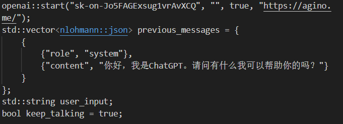
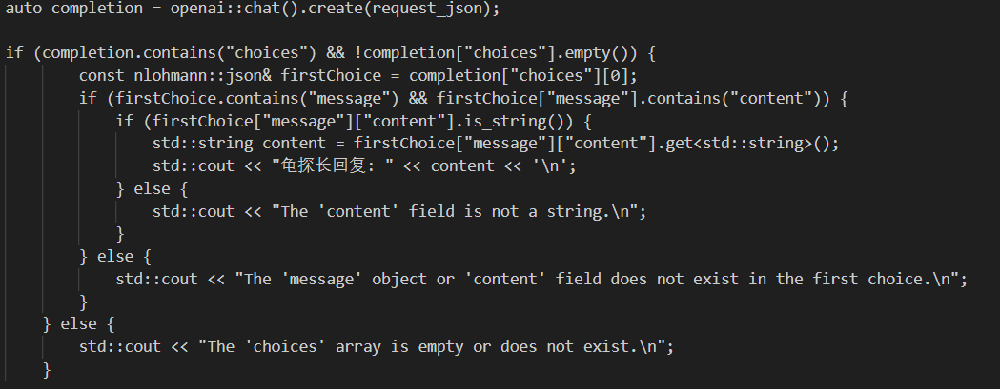
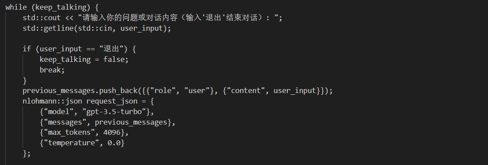
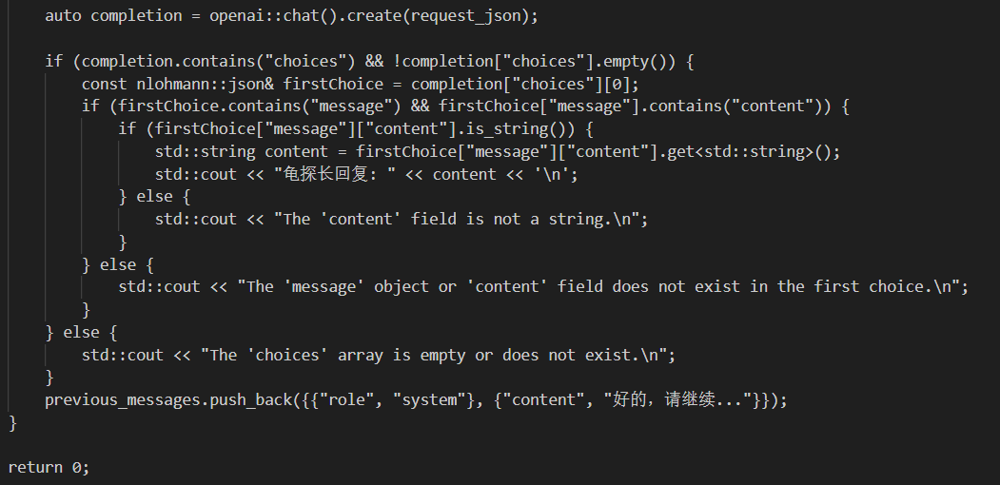

# 程序设计实践大作业
## 代码展示
### 1.00-showcase
~~~
#include "openai.hpp"
#include "nlohmann/json.hpp"
#include <iostream>
#include <vector>

int main() {
    openai::start("sk-on-Jo5FAGExsug1vrAvXCQ", "", true, "https://agino.me/"); 
    std::vector<nlohmann::json> previous_messages = {
        {
            {"role", "system"},
            {"content", "你好，我是ChatGPT。请问有什么我可以帮助你的吗？"}
        }
    };
    std::string user_input;
    bool keep_talking = true;
    
    //前置内部对话
    previous_messages.push_back({{"role", "user"}, {"content", " 海龟汤游戏是一种推理游戏，其玩法大致如下：出题者：给出一个不完整的故事（汤面），这个故事中通常包含一些难以直接理解的元素或情节。答题者：通过提问问题来试图还原故事的完整内容（汤底）。答题者可以提出任何问题，而出题者只能回答“是”、“不是”或“与此无关”来提供线索。目标：答题者需要通过不断提问和收集线索，最终揭示出故事的完整内容和背后的真相。我给你几个经典的海龟汤故事，仅供参考：1.【汤面】某个村子每家每户过了0点必须关灯，于此同时半夜三更都会传来怪叫声，虽然把全村人都吵醒都没有人出去看。真相是什么？【汤底】村中有个人人皆知的变态杀人狂，行迹神秘且有夜盲症，所以全村人都必须要在晚上关灯。由于杀人狂在没有灯的地方找不到人，于是就用怪叫声来吸引村民夜晚开灯并将其杀死。2.【汤面】小梅和老公小王驾车旅游，深夜在一条山路车抛锚了，小王说要走到前面的镇子里去找一位修理工，小梅先留在车里。在车内看不到外面的情况下，夫妻俩约定小王回来时敲三下车门小梅就开门，过了不久，小梅听到了很多次敲门声但从来都不是三下。请推理出故事全貌。【汤底】小王刚走不久就被守株待兔的变态杀人犯杀了，拖着他的尸体回到了车旁边，把他吊在了旁边的树上，当时风很大，小王的头时常会撞到车门再回弹撞很多次。请注意：1.当你是出题者，你提供的是一个不完整的故事（汤面），这个故事中通常包含一些难以直接理解的元素或情节。然后我会向你提出问题，你只能基于刚刚的故事真实回答“是”、“不是”或“与此无关”。2.当我是出题者，我会向你提供一个汤面，然后你每次只能提出一个问题，你提的问题是为了让你自己去还原整个故事，同时，你提的问题我只能回复“是”、“不是”或“与此无关”。所以你的问题应该让我更好回答。如果你实在不知道汤底，可以给我说“请公布汤底”。接下来，我们一起玩海龟汤游戏吧！请你说“我们一起玩海龟汤吧，请问你想当出题者还是答题者”？"}});
    nlohmann::json request_json = {
            {"model", "gpt-3.5-turbo"},
            {"messages", previous_messages},
            {"max_tokens", 4096},
            {"temperature", 0.0} 
        };
    auto completion = openai::chat().create(request_json);
    
    if (completion.contains("choices") && !completion["choices"].empty()) {
            const nlohmann::json& firstChoice = completion["choices"][0];
            if (firstChoice.contains("message") && firstChoice["message"].contains("content")) {
                if (firstChoice["message"]["content"].is_string()) {
                    std::string content = firstChoice["message"]["content"].get<std::string>();
                    std::cout << "龟探长回复: " << content << '\n';
                } else {
                    std::cout << "The 'content' field is not a string.\n";
                }
            } else {
                std::cout << "The 'message' object or 'content' field does not exist in the first choice.\n";
            }
        } else {
            std::cout << "The 'choices' array is empty or does not exist.\n";
        }

    while (keep_talking) {
        std::cout << "请输入你的问题或对话内容（输入'退出'结束对话）: ";
        std::getline(std::cin, user_input);

        if (user_input == "退出") {
            keep_talking = false;
            break;
        }
        previous_messages.push_back({{"role", "user"}, {"content", user_input}});
        nlohmann::json request_json = {
            {"model", "gpt-3.5-turbo"},
            {"messages", previous_messages},
            {"max_tokens", 4096},
            {"temperature", 0.0} 
        };

        auto completion = openai::chat().create(request_json);

        if (completion.contains("choices") && !completion["choices"].empty()) {
            const nlohmann::json& firstChoice = completion["choices"][0];
            if (firstChoice.contains("message") && firstChoice["message"].contains("content")) {
                if (firstChoice["message"]["content"].is_string()) {
                    std::string content = firstChoice["message"]["content"].get<std::string>();
                    std::cout << "龟探长回复: " << content << '\n';
                } else {
                    std::cout << "The 'content' field is not a string.\n";
                }
            } else {
                std::cout << "The 'message' object or 'content' field does not exist in the first choice.\n";
            }
        } else {
            std::cout << "The 'choices' array is empty or does not exist.\n";
        }
        previous_messages.push_back({{"role", "system"}, {"content", "好的，请继续..."}}); 
    }

    return 0;
}
~~~
### 2.01-model
~~~
#include "openai.hpp"
#include "nlohmann/json.hpp"
#include <iostream>
#include <vector>

int main() {
    openai::start("sk-on-Jo5FAGExsug1vrAvXCQ", "", true, "https://agino.me/"); 
    std::vector<nlohmann::json> previous_messages = {
        {
            {"role", "system"},
            {"content", "你好，我是ChatGPT。请问有什么我可以帮助你的吗？"}
        }
    };
    std::string user_input;
    bool keep_talking = true;
    
    //前置内部对话
    previous_messages.push_back({{"role", "user"}, {"content", "海龟汤游戏是一种推理游戏，其玩法大致如下：出题者：给出一个不完整的故事（汤面），这个故事中通常包含一些难以直接理解的元素或情节。答题者：通过提问问题来试图还原故事的完整内容（汤底）。答题者可以提出任何问题，而出题者只能回答“是”、“不是”或“与此无关”来提供线索。目标：答题者需要通过不断提问和收集线索，最终揭示出故事的完整内容和背后的真相。当我是出题者，我会向你提供一个汤面，然后你每次只能提出一个问题，你提的问题是为了让你自己去还原整个故事，同时，你提的问题我只能回复“是”、“不是”或“与此无关”。所以你的问题应该让我更好回答。如果你实在不知道汤底，可以给我说“请公布汤底”。接下来，我们一起玩海龟汤游戏吧！请你说“我们一起玩海龟汤吧，请给我一个汤面”？"}});
    nlohmann::json request_json = {
            {"model", "gpt-3.5-turbo"},
            {"messages", previous_messages},
            {"max_tokens", 4096},
            {"temperature", 0.0} 
        };
    auto completion = openai::chat().create(request_json);
    
    if (completion.contains("choices") && !completion["choices"].empty()) {
            const nlohmann::json& firstChoice = completion["choices"][0];
            if (firstChoice.contains("message") && firstChoice["message"].contains("content")) {
                if (firstChoice["message"]["content"].is_string()) {
                    std::string content = firstChoice["message"]["content"].get<std::string>();
                    std::cout << "【模式二】龟探长回复: " << content << '\n';
                } else {
                    std::cout << "The 'content' field is not a string.\n";
                }
            } else {
                std::cout << "The 'message' object or 'content' field does not exist in the first choice.\n";
            }
        } else {
            std::cout << "The 'choices' array is empty or does not exist.\n";
        }

    while (keep_talking) {
        std::cout << "请输入你的问题或对话内容（输入'退出'结束对话）: ";
        std::getline(std::cin, user_input);

        if (user_input == "退出") {
            keep_talking = false;
            break;
        }
        previous_messages.push_back({{"role", "user"}, {"content", user_input}});
        nlohmann::json request_json = {
            {"model", "gpt-3.5-turbo"},
            {"messages", previous_messages},
            {"max_tokens", 4096},
            {"temperature", 0.0} 
        };

        auto completion = openai::chat().create(request_json);

        if (completion.contains("choices") && !completion["choices"].empty()) {
            const nlohmann::json& firstChoice = completion["choices"][0];
            if (firstChoice.contains("message") && firstChoice["message"].contains("content")) {
                if (firstChoice["message"]["content"].is_string()) {
                    std::string content = firstChoice["message"]["content"].get<std::string>();
                    std::cout << "【模式二】龟探长回复: " << content << '\n';
                } else {
                    std::cout << "The 'content' field is not a string.\n";
                }
            } else {
                std::cout << "The 'message' object or 'content' field does not exist in the first choice.\n";
            }
        } else {
            std::cout << "The 'choices' array is empty or does not exist.\n";
        }
        previous_messages.push_back({{"role", "system"}, {"content", "好的，请继续..."}}); 
    }

    return 0;
}
~~~
### 02-completion
~~~
#include "openai.hpp"
#include "nlohmann/json.hpp"
#include <iostream>
#include <vector>

int main() {
    openai::start("sk-on-Jo5FAGExsug1vrAvXCQ", "", true, "https://agino.me/"); 
    std::vector<nlohmann::json> previous_messages = {
        {
            {"role", "system"},
            {"content", "你好，我是ChatGPT。请问有什么我可以帮助你的吗？"}
        }
    };
    std::string user_input;
    bool keep_talking = true;
    
    //前置内部对话
    previous_messages.push_back({{"role", "user"}, {"content", "模拟人生游戏规则： 你要自己创建一个具有特定性格和背景的角色，让玩家与之进行互动。 就像是模拟人生，在每一次问答，就是模拟这个人物角色每一个人生阶段，你需要给出不同的选择，而玩家的不同选择会导致最后的人生走向不同。请你创建这样一个角色吧！当玩家说“结束模拟人生”，你需要给出玩家这个角色这一生的经历与结果。"}});
    nlohmann::json request_json = {
            {"model", "gpt-3.5-turbo"},
            {"messages", previous_messages},
            {"max_tokens", 4096},
            {"temperature", 0.0} 
        };
    auto completion = openai::chat().create(request_json);
    
    if (completion.contains("choices") && !completion["choices"].empty()) {
            const nlohmann::json& firstChoice = completion["choices"][0];
            if (firstChoice.contains("message") && firstChoice["message"].contains("content")) {
                if (firstChoice["message"]["content"].is_string()) {
                    std::string content = firstChoice["message"]["content"].get<std::string>();
                    std::cout << "角色扮演机器人回复: " << content << '\n';
                } else {
                    std::cout << "The 'content' field is not a string.\n";
                }
            } else {
                std::cout << "The 'message' object or 'content' field does not exist in the first choice.\n";
            }
        } else {
            std::cout << "The 'choices' array is empty or does not exist.\n";
        }

    while (keep_talking) {
        std::cout << "请输入你的问题或对话内容（输入'退出'结束对话）: ";
        std::getline(std::cin, user_input);

        if (user_input == "退出") {
            keep_talking = false;
            break;
        }
        previous_messages.push_back({{"role", "user"}, {"content", user_input}});
        nlohmann::json request_json = {
            {"model", "gpt-3.5-turbo"},
            {"messages", previous_messages},
            {"max_tokens", 4096},
            {"temperature", 0.0} 
        };

        auto completion = openai::chat().create(request_json);

        if (completion.contains("choices") && !completion["choices"].empty()) {
            const nlohmann::json& firstChoice = completion["choices"][0];
            if (firstChoice.contains("message") && firstChoice["message"].contains("content")) {
                if (firstChoice["message"]["content"].is_string()) {
                    std::string content = firstChoice["message"]["content"].get<std::string>();
                    std::cout << "角色扮演机器人回复: " << content << '\n';
                } else {
                    std::cout << "The 'content' field is not a string.\n";
                }
            } else {
                std::cout << "The 'message' object or 'content' field does not exist in the first choice.\n";
            }
        } else {
            std::cout << "The 'choices' array is empty or does not exist.\n";
        }
        previous_messages.push_back({{"role", "system"}, {"content", "好的，请继续..."}}); 
    }

    return 0;
}
~~~

## 主要代码分析

# 初始化历史消息，创建一个previous_messages向量，用于与ChatGPT对话。并声明用户输入的字符串和一个布尔变量，用于控制对话循环。

# 向AI发送请求并获取响应然后当包含选择且不为空时获取第一个选择并且提取并打印他。
 
# 实现对话循环。将用户输入添加到previous-messages中，并创建新的请求JSON对象，然后发送请求并处理响应，显示模型的回复。

